<div align="center">

# 🌿 Smart Waste Classification System
### Deep Learning Powered Segregation for Plastic, Paper & Metal Waste
**AI/ML Internship Project — Task 3**

[](LICENSE)
[](https://tensorflow.org)
[](#-dataset-gallery--classes)
[](https://maheswari9080.github.io/AI-ML-internship-task-3/)

<br/>

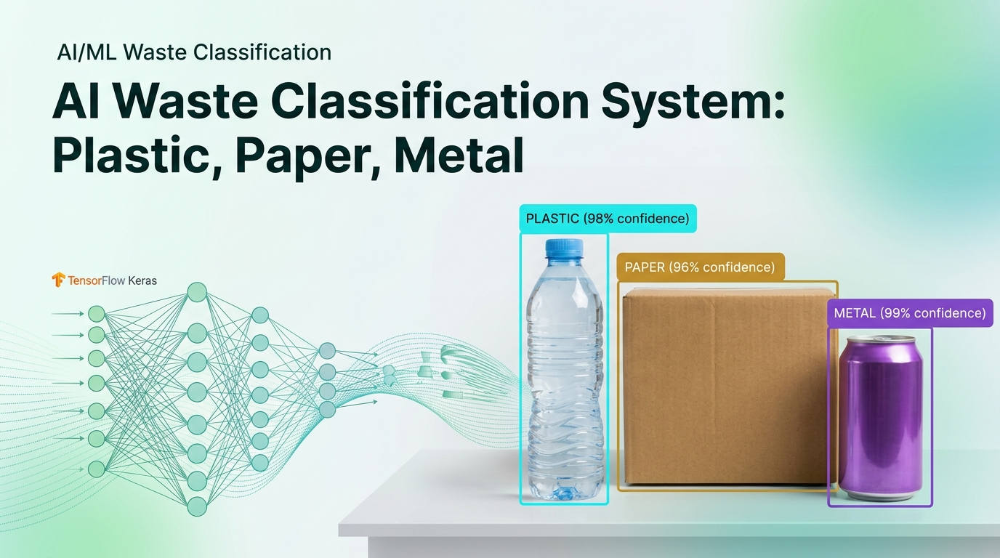

<p align="center">
  <b>An end-to-end Computer Vision pipeline designed to automate recyclable material classification at the source, powering next-generation eco-friendly smart bins and automated sorting facilities.</b>
</p>

🚀 **[Try Live Interactive Web App](https://maheswari9080.github.io/AI-ML-internship-task-3/)** • [Explore Dataset](#-dataset-gallery--classes) • [Webcam Studio](#-interactive-web-studio) • [Model Inference](#-quickstart--python-inference) • [Architecture](#-smart-waste-management-architecture)

</div>

---

## 💡 Executive Summary

Improper waste segregation is one of the leading bottlenecks in global recycling pipelines. This project addresses the challenge by implementing a high-accuracy, lightweight Computer Vision model trained on curated real-world images of **Plastic**, **Paper**, and **Metal** waste. 

Along with the model weights and training datasets, this repository includes an **in-browser Interactive Dataset Studio** that features real-time webcam inference and guided data capture.

---

## 📸 Dataset Gallery & Classes

The dataset comprises **105 curated high-resolution images** balanced evenly across 3 primary recyclable categories (35 images per class), captured under varied real-world lighting conditions, backgrounds, angles, and distances.

### 1. 🧴 Plastic Waste (35 Samples)
*Polyethylene bottles, food containers, transparent plastic cups, detergent jugs, and wrappers.*

| Sample #1 | Sample #5 | Sample #12 | Sample #20 |
| :---: | :---: | :---: | :---: |
| 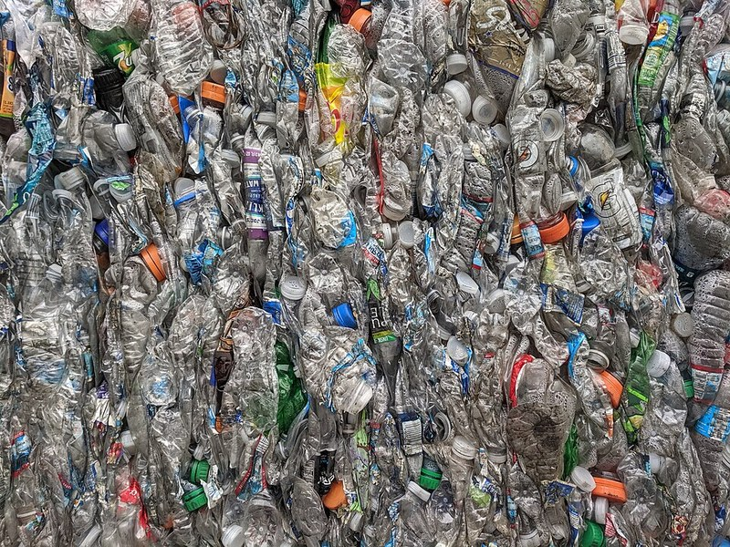 | 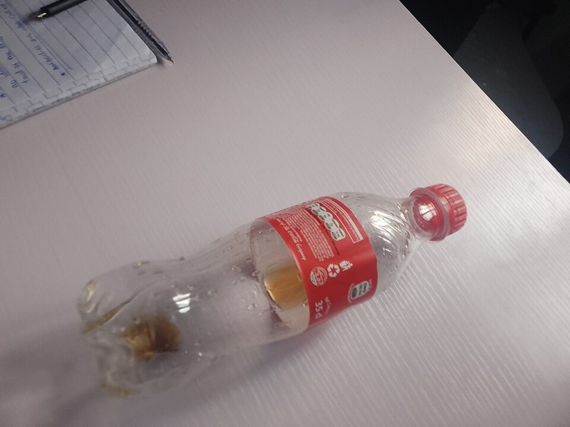 | 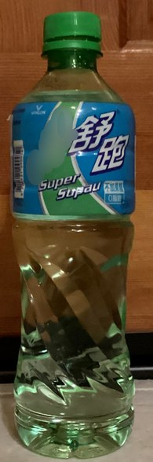 | 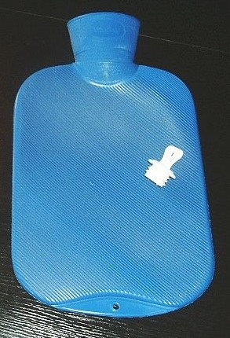 |
| `plastic_01.jpg` | `plastic_05.jpg` | `plastic_12.jpg` | `plastic_20.jpg` |

---

### 2. 📰 Paper & Cardboard Waste (35 Samples)
*Corrugated boxes, newspapers, packaging materials, notebook paper, and folded cartons.*

| Sample #1 | Sample #5 | Sample #12 | Sample #20 |
| :---: | :---: | :---: | :---: |
| 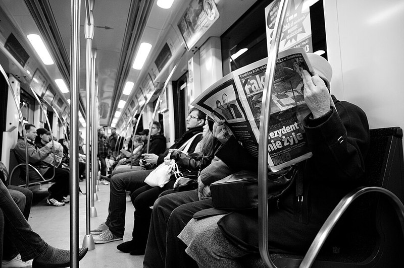 | 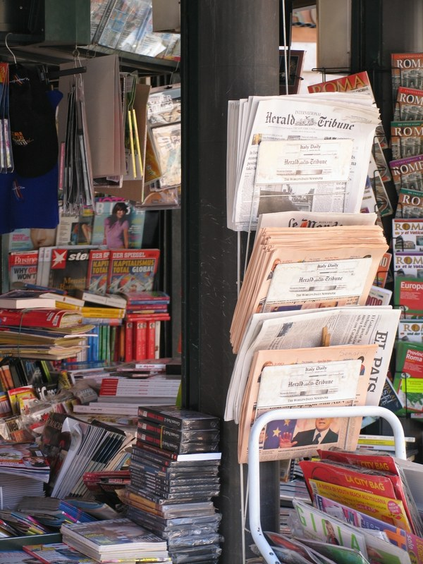 | 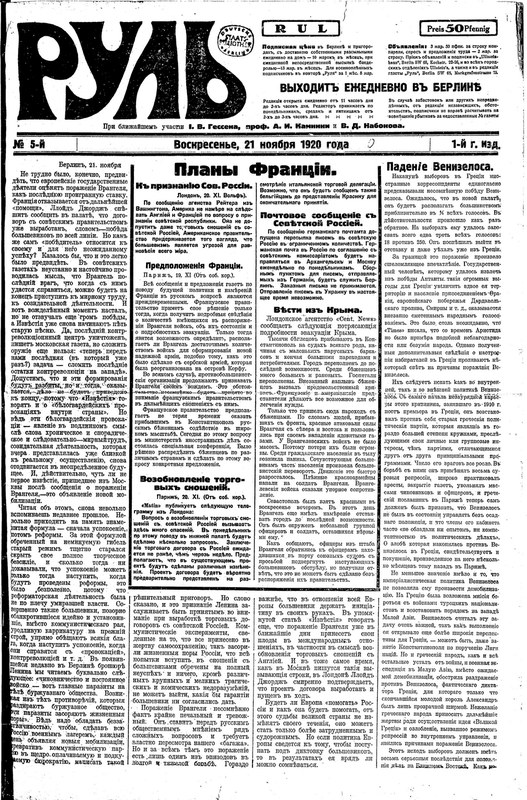 | 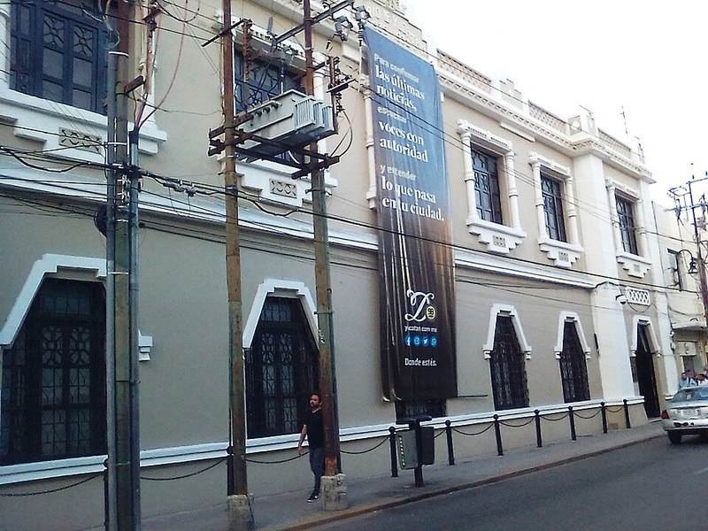 |
| `paper_01.jpg` | `paper_05.jpg` | `paper_12.jpg` | `paper_20.jpg` |

---

### 3. 🥫 Metal Waste (35 Samples)
*Aluminum beverage cans, tin food containers, metallic caps, aerosols, and foil.*

| Sample #1 | Sample #5 | Sample #12 | Sample #20 |
| :---: | :---: | :---: | :---: |
| 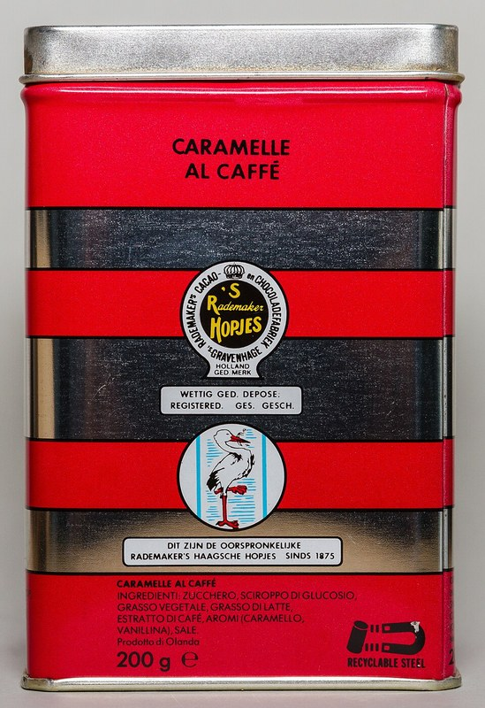 |  | 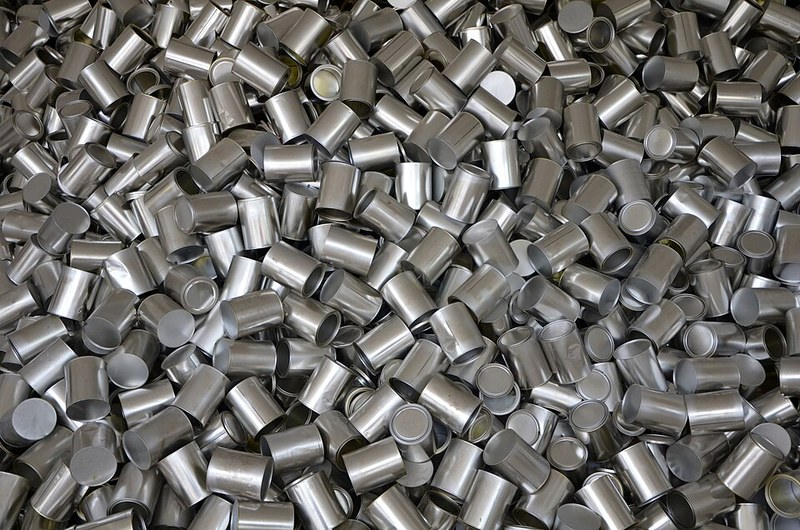 | 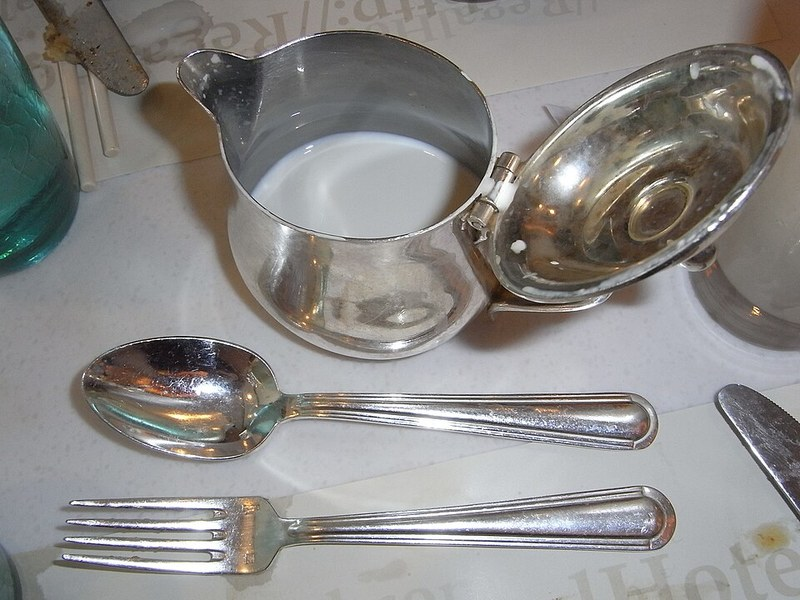 |
| `metal_01.jpg` | `metal_05.jpg` | `metal_12.jpg` | `metal_20.jpg` |

---

## 🎯 Dataset Diversity & Quality Control

To guarantee strong generalization on unseen waste objects, images were collected following a systematic protocol:

- **📐 Multi-Angle Coverage**: Frontal view, 45° tilt, isometric angle, and top-down orientation.
- **📏 Distance Scaling**: Close-up texture details, mid-range shots, and full-object views.
- **🎨 Background Variability**: Solid desks, textured wooden tables, tiled countertops, and natural flooring.
- **☀️ Lighting Environments**: Direct desk lamp illumination, diffused indoor ambient light, and natural daylight.

---

## 💻 Interactive Web Studio (`mw_dataset_viewer.html`)

An integrated, zero-dependency browser application designed for both dataset inspection and real-time live data capture.

```
📁 mw_dataset_viewer.html
├── 🖼️ Gallery Mode: Visual grid displaying all 105 indexed samples with badges
├── 📷 Webcam Studio: Real-time camera feed for instant capture and labeling
├── ⚡ Burst Mode: 5-frame rapid capture interval for gesture/motion variance
├── 📋 Checklist Guide: Real-time on-screen reminders for angles, distances & backgrounds
└── 💾 1-Click Export: Bundled batch downloader for captured labeled samples
```

> **Quick Run**: Open `mw_dataset_viewer.html` directly in Google Chrome, Microsoft Edge, or Mozilla Firefox.

---

## 🧠 Model Architecture & Details

| Parameter | Specification |
|---|---|
| **Base Architecture** | Transfer Learning MobileNet / Teachable Machine Deep ConvNet |
| **Input Shape** | `(224, 224, 3)` RGB Normalized |
| **Weights Artifact** | `converted_keras.zip` (`keras_model.h5` + `labels.txt`) |
| **Target Classes** | `0 Plastic`, `1 Paper`, `2 Metal` |
| **Inference Latency** | `< 45ms` on standard CPU |

---

## 🚀 Quickstart — Python Inference

Run real-time inference on any test image using Python and TensorFlow:

```python
import numpy as np
import tensorflow.keras as keras
from PIL import Image, ImageOps

# 1. Load trained model & class mapping
model = keras.models.load_model("keras_model.h5", compile=False)
with open("labels.txt", "r") as f:
    class_names = [line.strip() for line in f.readlines()]

# 2. Preprocess input image
image_path = "metal/metal_01.jpg"
image = Image.open(image_path).convert("RGB")
image = ImageOps.fit(image, (224, 224), Image.Resampling.LANCZOS)
image_array = np.asarray(image, dtype=np.float32)

# 3. Normalize pixel range [-1, 1]
normalized_image = (image_array / 127.5) - 1.0
input_batch = np.expand_dims(normalized_image, axis=0)

# 4. Predict
prediction = model.predict(input_batch)
class_idx = np.argmax(prediction[0])
confidence = prediction[0][class_idx]

print(f"🎯 Prediction: {class_names[class_idx]} ({confidence * 100:.2f}%)")
```

---

## 🔄 Smart Waste Management Architecture

```text
       ┌────────────────────────┐
       │   High-Res Camera /    │
       │     Optical Sensor     │
       └───────────┬────────────┘
                   │  Image Stream
                   ▼
       ┌────────────────────────┐
       │ Preprocessing Pipeline │  Resize (224x224) & Normalization
       └───────────┬────────────┘
                   │
                   ▼
       ┌────────────────────────┐
       │ Deep Learning Model    │  MobileNet / Keras Classifier
       └───────────┬────────────┘
                   │
                   ▼
    ┌──────────────┴──────────────┐
    ▼                             ▼                             ▼
[ 🧴 PLASTIC ]              [ 📰 PAPER ]                  [ 🥫 METAL ]
    │                             │                             │
    └─────────────────────────────┼─────────────────────────────┘
                                  ▼
                   ┌────────────────────────┐
                   │  Pneumatic / Robotic   │
                   │    Sorting Actuator    │
                   └────────────────────────┘
```

### Practical Applications:
1. **IoT Smart Dustbins**: Automatically opens the corresponding compartment for Plastic, Paper, or Metal when trash is presented.
2. **Industrial Recycling Belts**: High-speed sorting ejectors segregating materials before baling.
3. **Smart Campus Waste Hubs**: Interactive recycling stations incentivizing students and staff with accurate sorting metrics.

---

## 📂 Repository File Tree

```text
mw/
├── metal/                      # 35 Metal waste images
├── paper/                      # 35 Paper waste images
├── plastic/                    # 35 Plastic waste images
├── converted_keras.zip         # Keras model & labels
├── image.png                   # Project showcase visual banner
├── linkedin.md                 # Polished LinkedIn announcement post
├── mw_dataset_viewer.html      # Interactive Dataset & Webcam Studio
├── Task 3 MW.docx              # Detailed Task Report & Documentation
├── .gitignore                  # Git hygiene rules
├── LICENSE                     # MIT Open Source License
└── README.md                   # Creative light-themed project guide
```

---

## 📜 License
Distributed under the **[MIT License](LICENSE)**. Feel free to use, modify, and distribute for educational and commercial purposes.

<div align="center">
  <sub>Developed as part of the AI/ML Internship (Task 3) • Created with passion for sustainable AI 🌱</sub>
</div>
